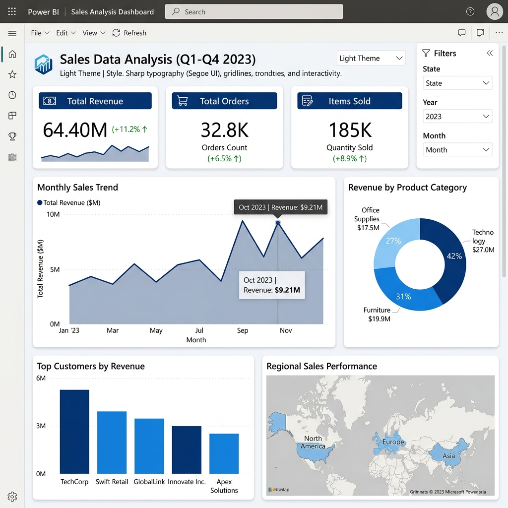

# 📊 Sales Data Analysis & Power BI Dashboard



## 📝 Overview
This project is a comprehensive end-to-end data analytics workflow designed to simulate a real-world business intelligence pipeline. Starting from generating raw mock data, the project progresses through data cleaning with Python, exploratory data analysis via SQL, and finally, interactive visualization using Microsoft Power BI.

The goal is to analyze over 50,000 retail transactions to uncover actionable insights regarding revenue generation, product performance, and customer lifetime value.

## 🚀 Key Features & Outcomes
* **Data Engineering:** Generated a robust dataset of 52,000+ records, complete with intentional "dirty" data (missing IDs, negative quantities) to simulate real-world data issues.
* **Data Preprocessing:** Utilized Pandas to clean the data, impute missing values, fix data types, and engineer new features (e.g., `TotalRevenue`, `YearMonth`).
* **SQL Analysis:** Executed complex queries to extract key performance indicators (KPIs) such as total revenue ($64.4M+), top-selling categories (Electronics leading), and identifying the top 10 most valuable customers.
* **Interactive Dashboard:** Built a dynamic Power BI dashboard featuring trend lines, KPI cards, and category breakdowns.

## 🛠️ Tech Stack
* **Python (Pandas, Numpy, SQLite3)** - Data Generation, Cleaning, & Automation
* **SQL** - Data Aggregation and Metrics Extraction
* **Microsoft Power BI** - Data Visualization and Dashboarding

## 📂 Project Structure
* `generate_data.py`: Creates `raw_sales_data.csv` with raw transactional data.
* `data_cleaning.py`: Reads the raw data, cleans it, engineers features, and outputs `cleaned_sales_data.csv`.
* `run_sql_analysis.py`: Automates the process of loading the cleaned CSV into an in-memory SQLite database, runs the SQL queries, and saves the output to a text file.
* `analysis_queries.sql`: A collection of SQL queries used for extracting business insights.
* `analysis_results.txt`: The text output generated from the SQL queries containing the finalized metrics.
* `power_bi_dashboard_guide.md`: A step-by-step guide for creating the Power BI dashboard.
* `screenshots/`: Folder containing visuals of the final Power BI dashboard.

## 💻 How to Run the Project Locally

1. **Clone the Repository**
   ```bash
   git clone https://github.com/pavani08-dotcom/sales-data-analysis-powerbi.git
   cd sales-data-analysis-powerbi
   ```

2. **Install Dependencies**
   Ensure you have Python installed, then install Pandas:
   ```bash
   pip install pandas numpy
   ```

3. **Generate & Clean Data**
   Run the following scripts sequentially:
   ```bash
   python generate_data.py
   python data_cleaning.py
   ```

4. **Run SQL Analysis**
   To execute the queries and see the business metrics:
   ```bash
   python run_sql_analysis.py
   ```
   *Check `analysis_results.txt` to view the outputs!*

5. **Open Power BI**
   - Open Power BI Desktop.
   - Import `cleaned_sales_data.csv`.
   - Follow the `power_bi_dashboard_guide.md` to recreate the visuals.

## 📈 Key Findings
1. **Total Revenue:** Surpassed **$64.4 Million** over the tracking period across 282,000+ items sold.
2. **Top Category:** **Electronics** drove the overwhelming majority of revenue ($44.5M), followed by Home & Garden.
3. **Top Products:** Smartphones and Laptops were the highest revenue-generating individual products.
4. **Customer Spend:** The top 10 customers have a significantly high lifetime value, each spending over $45,000.
